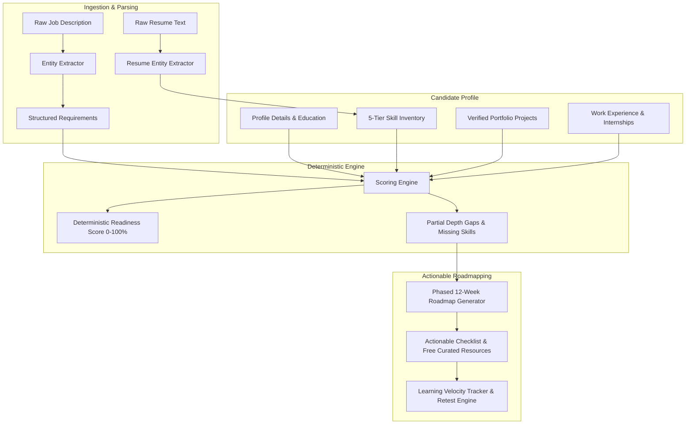

# SkillGap AI — System Architecture & Methodology

## 1. System Overview

SkillGap AI is designed to replace black-box generative "AI magic" with an explainable, deterministic scoring engine and personalized learning roadmaps.

---

## 2. Deterministic Scoring Algorithm

The readiness score is calculated as a transparent weighted sum of 5 distinct components:

$$\text{Readiness Score} = \sum (W_i \times S_i)$$

Where:
- **Technical Skills ($S_{\text{tech}}$)**: 45–50%
- **Experience ($S_{\text{exp}}$)**: 15–20%
- **Portfolio Projects ($S_{\text{proj}}$)**: 10–15%
- **Education ($S_{\text{edu}}$)**: 10%
- **Soft Skills ($S_{\text{soft}}$)**: 10%

### Proficiency Depth Modeling
Each skill is ranked from 1 to 5:
1. **Beginner**: Syntax familiarity and execution.
2. **Elementary**: Standalone functions and basic scripts.
3. **Intermediate**: Independent feature building, schema modeling, and debugging.
4. **Advanced**: Performance profiling, query plans (EXPLAIN ANALYZE), concurrency, and systems internals.
5. **Expert**: Architecture design, framework authoring, and distributed systems leadership.

When a role demands **Advanced** (Rank 4) and a candidate has **Intermediate** (Rank 3), the engine:
1. Awards partial credit ($3/4 = 75\%$).
2. Generates an explainable human diagnostic card specifying the precise advanced topics required to close the gap.
3. Flags the skill as a priority target in Phase 2 of the roadmap.

---

## 3. Monorepo Organization

- `apps/web`: React 18, TypeScript, Tailwind CSS, Vite, Lucide icons, React Router v6.
- `apps/api`: Node.js, Express, TypeScript, Prisma ORM, JWT authentication, bcrypt.
- `packages/types`: Type definitions shared across client and server.
- `packages/config`: Master skills registry (100+ skills), 15+ career role benchmarks, sample job descriptions.
- `packages/analytics`: Pure deterministic scoring algorithm and roadmap generator.
- `packages/validation`: Zod schemas for runtime request validation.
- `packages/ui`: Shared design tokens, badge styles, and score gauge helpers.
- `database/prisma`: Schema definition with SQLite (local development) and PostgreSQL (production).
